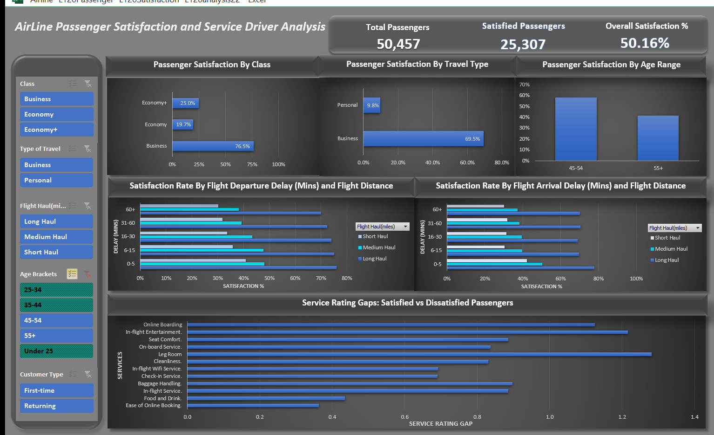

# ✈️ Airline Passenger Satisfaction BI Dashboard

## 📊 Project Overview

This is an interactive Business Intelligence dashboard built using **Microsoft Excel** to analyze passenger satisfaction patterns across **129,880 passenger records**.  

The objective was to identify key satisfaction drivers, evaluate operational performance impacts and provide actionable insights for customer experience optimization.  

Dynamic slicers, pivot tables and service gap analysis enable scenario-based exploration across passenger demographics, travel behavior and service touchpoints.

---
## 📸 Visual Assets

This section contains all visual assets supporting the dashboard analysis. Each image and video is labeled for easy reference.

---

*Fig 1 – Dashboard Overview*

 

---

*Fig 2 – Age Segment Insight View (45–54 and 55+ Filtered)*

  

---

*Video 1 – Dynamic Dashboard Demo*

*Note:* This video shows interactive slicer usage, age-segment filtering and dynamic updates reflecting service gap changes.

## 🎯 Business Problem

Airlines operate in a highly competitive environment where customer satisfaction directly affects retention, revenue and brand loyalty.  

This project addresses critical business questions:

- What drives passenger satisfaction across demographics and travel types?  
- How do operational delays influence customer experience?  
- Which service features provide the largest satisfaction uplift?  
- How do service priorities differ across age groups?

---

## 📐 Analytical Methodology

The analysis was conducted using descriptive statistical modeling to evaluate customer experience performance across service touchpoints.

Service gap scores were calculated by comparing average service ratings between satisfied passengers (Satisfaction = 1) and dissatisfied passengers (Satisfaction = 0). The mean difference between these groups was used to identify service attributes with the highest impact on overall customer experience.

This approach functions as a behavioral impact analysis, showing which operational and service quality factors most strongly influence passenger satisfaction outcomes.

---

## 📌 Key Performance Metrics

**Overall Performance**

- Total passengers: **129,880**  
- Overall satisfaction rate: **43.45%**

**Class-Level Performance**

- Business class: **69.4%**  
- Economy+: **24.6%**  
- Economy: **18.8%**

**Customer Loyalty**

- Returning passengers: **47.8% satisfaction**  
- First-time passengers: **24% satisfaction**

**Age-Based Satisfaction**

- Under 25 → 27.7%  
- 25–34 → 37%  
- 35–44 → **50.4% (Highest)**  
- 55+ → 41.3%

**Insight:** Satisfaction generally increases with age, peaking in mid-age segments, suggesting experience and expectation differences influence perception.

---

## ⭐ Service Gap Analysis

Service gap analysis compares satisfaction vs dissatisfaction across key service touchpoints.

### Overall Service Gap Drivers (All Passengers)

- Online boarding experience → **1.4**  
- Inflight entertainment → **1.1**  
- Seat comfort → **0.9**  
- WiFi connectivity → **0.8**  
- Cleanliness → **0.8**  
- Onboard service → **0.8**  
- Food and drinks → **0.6**  
- Baggage handling → **0.6**  
- Check-in experience → **0.6**

**Interpretation:** Digital convenience and cabin comfort are the strongest determinants of satisfaction for the overall passenger population.

### Segment-Level Insight (Ages 45–54 and 55+)

When filtering older passengers, service priorities shift as seen in fig2:

- **Leg room comfort → 1.3**  
- **Inflight entertainment → 1.2**  
- **Online boarding experience → 1.1**

**Behavioral Insight:** Older passengers prioritize **physical comfort and in-flight experience** over digital convenience. This indicates that service design should be **segment-specific**, not one-size-fits-all.

---

## ✈️ Operational Performance Analysis

### Departure Delay vs Satisfaction

Passenger satisfaction declines as delay duration increases, particularly for short and medium haul flights.

| Delay Duration | Long Haul | Medium Haul | Short Haul |
|---|---|---|---|
| 0–5 minutes | 71.6% | 42.9% | 35.9% |
| 6–15 minutes | 69.0% | 40.5% | 30.6% |
| 16–30 minutes | 65.7% | 37.1% | 26.5% |
| 31–60 minutes | 64.0% | 34.3% | 25.8% |
| 60+ minutes | 62.6% | 33.4% | 26.2% |

**Insight:** Short-haul passengers are highly sensitive to delays, emphasizing the need for operational efficiency and communication during disruptions.

---

## 👥 Customer Segmentation Insights

- **Returning passengers:** 47.8% satisfaction  
- **First-time passengers:** 24% satisfaction  

**Insight:** Consistency in passenger experience strongly influences customer loyalty. Returning passengers consistently rate their experience higher, highlighting the value of retention strategies.

---

## 🧾 Recommendations

### Experience Optimization

- **Digital Experience:** Enhance online boarding, mobile app experience and check-in processes (priority for younger/mid-age travelers).  
- **Cabin Comfort:** Increase leg room, improve seat ergonomics and upgrade in-flight entertainment (priority for 45+ passengers).  
- **Operational Communication:** Provide real-time delay notifications to manage expectations and reduce dissatisfaction.

### Operational Strategy

- Prioritize punctuality for short-haul flights  
- Implement segmented service strategies based on age and travel type  
- Monitor service gap changes dynamically using dashboards for continuous improvement

---

## 🚀 Future Enhancements

- Predictive passenger satisfaction modeling  
- Real-time integration with airline operational data  
- Automated BI reporting pipelines  
- Scenario-based recommendation engine for executives

---

## 🛠 Tools & Techniques

- Microsoft Excel (Pivot Tables, Calculated Metrics, Dynamic Text)  
- Interactive Slicers  
- KPI Dashboard Design  
- Service Gap Analysis  
- Multi-Segment Performance Evaluation  

---

## 👤 Author

Ezirim Micah Ndubuisi

BI Analyst & Excel Dashboard Developer
